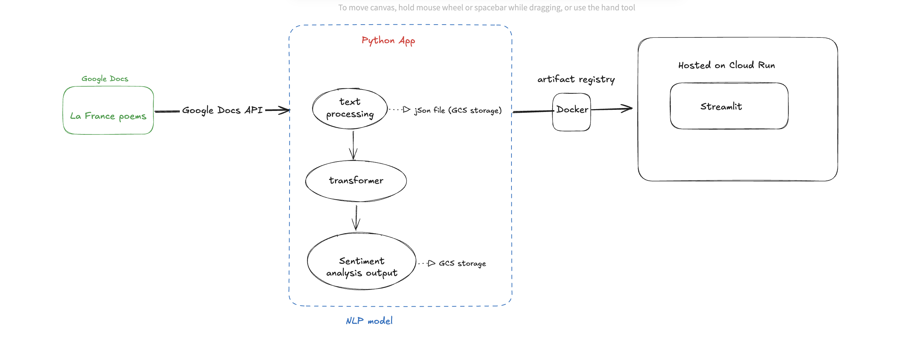

# Introduction

I wrote a poetry collection in an attempt to pass the DELF B2. While the exam remains eternally WIP, procrastination bred more poems, and with them, an idea for a project: a Python application that uses GPT4 and Hugging Face Transformers to inspect my poems and carve out the emotional undercurrents of my time in France.

Working in ML-adjacent data engineering has always been a dream — and this is the shape of that dream. It sits at the intersection of my past career and future aspirations: I used to write professionally. Now, I dissect language with programmed scalpels.

This is a small-scale data product MVP — and a deeply personal one. I had a lot of fun building it. I hope you enjoy exploring it too.

## 🧰 Tech Stack

🗃️ Google Docs API (poem ingestion)
🐍 Python + Poetry
🤗 Hugging Face Transformers (emoji classification)
🤖 OpenAI API (GPT-4 LLM analysis)
☁️ Google Cloud Storage (data IO)
🖥️ Streamlit (UI)
🐳 Docker + 🌐 Cloud Run (deployment)

## 🧠 System Architecture

