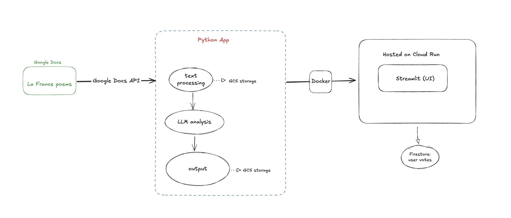

# Introduction

I wrote a poetry collection in an attempt to pass the DELF B2. While the exam remains eternally a WIP, procrastination bred more poems and, with them, an idea for a project: a lightweight Python application that uses GPT4 and Hugging Face Transformers to inspect my poems and carve out the emotional undercurrents of my time in France.

Working in ML-adjacent data engineering has always been a dream, and this project is the shape of that dream. It sits at the intersection of my past career and future aspirations: I used to write professionally. Now, I dissect language with code.

👉 Try the app: https://poetry-app-147956576814.europe-west1.run.app/. I had a lot of fun building it. I hope you enjoy exploring it too. 

## Tech Stack

- 🗃️ **Google Docs API** – poem ingestion  
- 🐍 **Python + Poetry**  
- 🤗 **Hugging Face Transformers** – emoji classification  
- 🤖 **OpenAI API** – GPT-4 LLM analysis  
- ☁️ **Google Cloud Storage** – data IO  
- 🔥 **Firestore** – store reader votes
- 🖥️ **Streamlit** – UI  
- 🐳 **Docker** + 🌐 **Cloud Run** – deployment  

## Architecture

